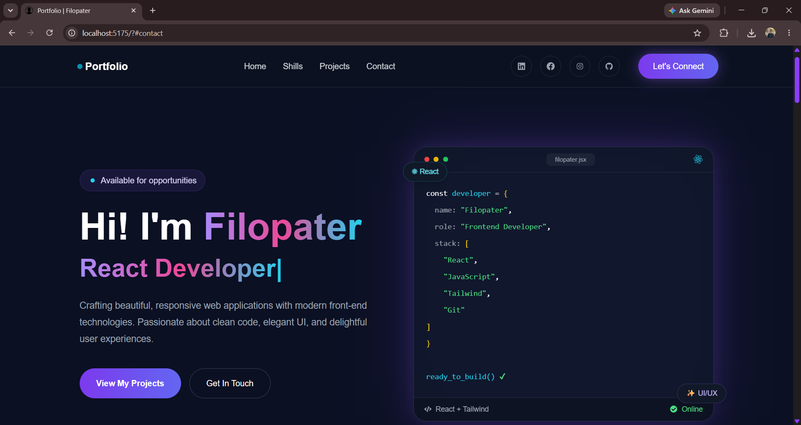
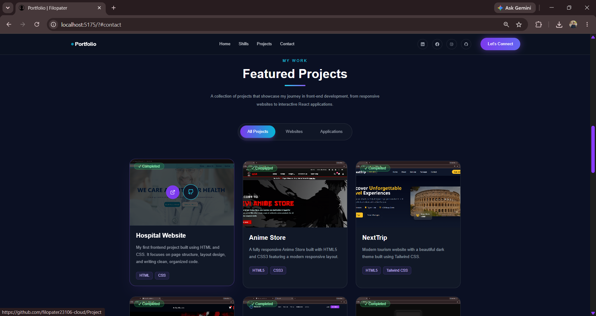
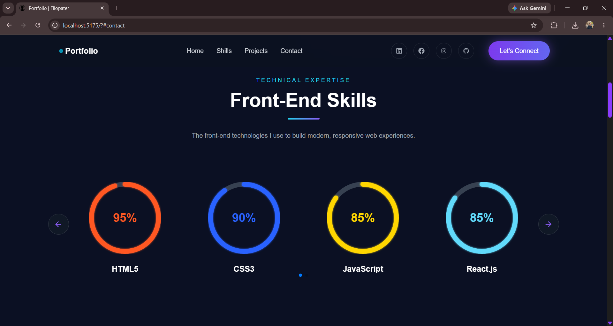
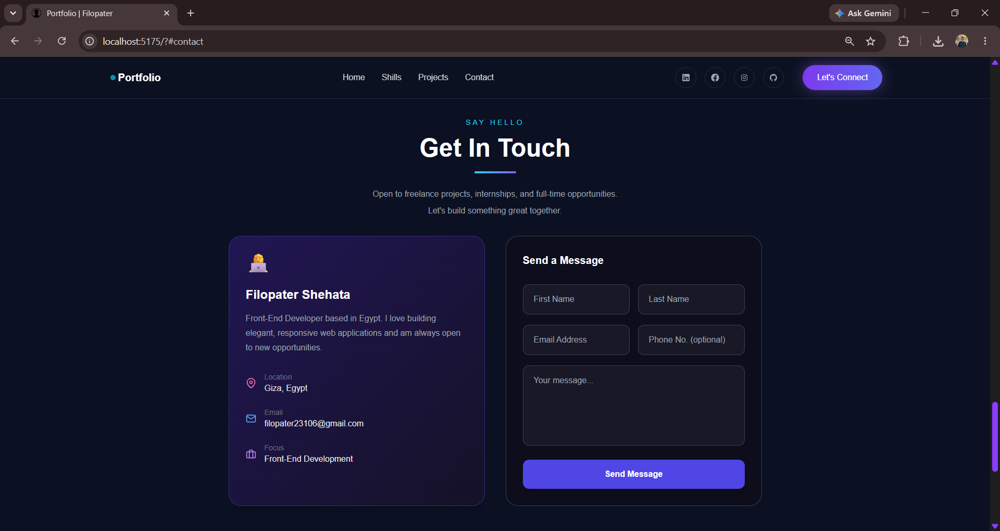

# 🌐 Personal Portfolio

<div align="center">

A modern, responsive, and interactive **Personal Portfolio** built with **React**, **Vite**, and **Tailwind CSS**.


</div>

---

# 📋 Overview

This portfolio website showcases my skills, projects, and experience through a clean, modern, and responsive interface.

The project follows a **component-based architecture** and demonstrates reusable React components, responsive layouts, interactive UI elements, and modern front-end development practices.

---

# 📸 Screenshots

<div align="center">

| Home | Projects |
|------|----------|
|  |  |

| Skills | Contact |
|--------|---------|
|  |  |

</div>

---

# 🚀 Live Demo

🌐 **Website**

https://YOUR-PORTFOLIO-LINK.vercel.app/

---

# 💻 GitHub Repository

https://github.com/filopater23106-cloud/Personal-Portfolio

---

# ✨ Features

## 🏠 Hero Section

- Professional introduction
- Animated typing effect
- Call-to-action buttons
- Interactive code card
- Responsive design

### 💼 Projects

- Featured project gallery
- Technology stack badges
- GitHub links
- Live demo links
- Hover animations

### 🎯 Skills

- Animated circular progress indicators
- Swiper slider
- Responsive layout
- Interactive navigation

### 📱 Responsive Design

Optimized for:

- Mobile
- Tablet
- Laptop
- Desktop

### 🎨 UI & UX

- Modern dark theme
- Glassmorphism cards
- Gradient text
- Smooth scrolling
- Hover animations
- Responsive navigation

---

# ⚛️ React Concepts Used

- Functional Components
- Component-Based Architecture
- React Hooks (`useState`)
- Props
- Conditional Rendering
- Dynamic Rendering
- Reusable Components

---

# 🛠 Technologies

## Frontend

| Technology | Purpose |
|------------|---------|
| React | UI Development |
| Vite | Build Tool |
| Tailwind CSS | Styling |
| JavaScript (ES6+) | Application Logic |
| Swiper | Skills Slider |
| React Icons | Icons |

---

## Tools

| Tool | Purpose |
|------|---------|
| Git | Version Control |
| GitHub | Source Code Hosting |
| Vercel | Deployment |
| VS Code | Code Editor |

---

# ⚙️ Installation

Clone the repository:

```bash
git clone https://github.com/filopater23106-cloud/Personal-Portfolio.git
```

Navigate to the project:

```bash
cd Personal-Portfolio
```

Install dependencies:

```bash
npm install
```

Run the development server:

```bash
npm run dev
```

Build for production:

```bash
npm run build
```

---

# 📁 Project Structure

```text
portfolio/
│
├── public/
├── screenshots/
├── src/
│   ├── assets/
│   ├── components/
│   │   ├── Board.jsx
│   │   ├── CodeCard.jsx
│   │   ├── Contact.jsx
│   │   ├── Footer.jsx
│   │   ├── Header.jsx
│   │   ├── Hero.jsx
│   │   ├── ProjectCard.jsx
│   │   ├── Projects.jsx
│   │   ├── Skills.jsx
│   │   ├── SliderButtons.jsx
│   │   ├── projectsData.js
│   │   └── skillsData.js
│   │
│   ├── App.jsx
│   ├── index.css
│   └── main.jsx
│
├── package.json
├── package-lock.json
├── vite.config.js
└── README.md
```

---

# 🎯 What I Learned

During this project I improved my understanding of:

- Building reusable React components
- Component-based architecture
- React Hooks
- State management
- Dynamic rendering
- Swiper integration
- Responsive UI development
- Tailwind CSS best practices
- Organizing scalable React projects
- Creating modern user interfaces

---

# 🚀 Future Improvements

- Dark / Light Mode
- Multi-language support
- Download CV feature
- EmailJS contact form
- Framer Motion animations
- More project filters
- Better accessibility
- Performance optimization

---

# 📄 License

This project is licensed under the **MIT License**.

---

# 👨‍💻 Author

<div align="center">

## Filopater Shehata

**Frontend Developer**

Faculty of Computer and Information  
Ain Shams University

⭐ If you like this project, consider giving it a star!

</div>
